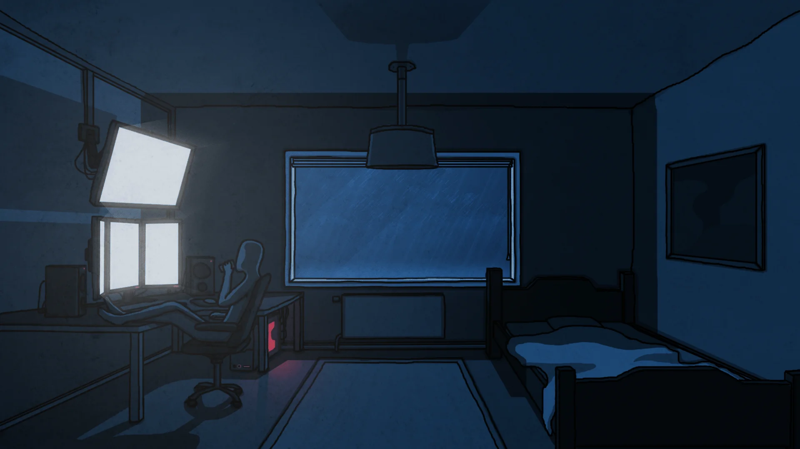

    

      
   <h1 style="color: white">Hi, I'm Henrique Franca!</h1>
    <h3>I am a Computer Science student and I am currently in the 4th period of the course. I really enjoy learning new things, new languages, algorithms, navigating this world of technology and recording everything here. I'm part of the Competitive Programming group at UNICAP, where we learn algorithms that will help us solve different problems, which ends up becoming something fascinating!
    </h3>

<h2>📞 You can contact me with</h2>
 
  
   

     
    <h2>💻 Skills</h2>
    
    
    
    
        

      
    

